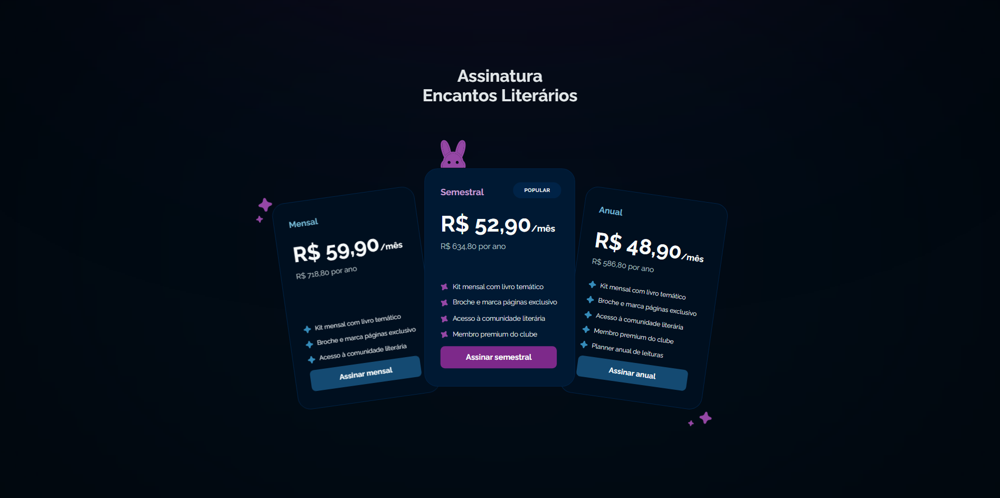

# Clube de Assinatura - Encantos Literários

O Clube de Assinatura - Encantos Literários é um site fictício desenvolvido para proporcionar uma experiência envolvente aos amantes da leitura. O projeto simula um serviço de assinatura de livros, onde os usuários podem receber seleções literárias cuidadosamente escolhidas com base em seus gêneros favoritos.

O site conta com uma interface atraente e interativa, utilizando animações em CSS para tornar a experiência mais dinâmica e cativante. Além disso, a responsividade foi implementada para garantir uma navegação fluida em diferentes dispositivos.

## Funcionalidades

- Exibição dinâmica do conceito "Encantos Literários, onde cada página vira uma nova história".

- Animações em CSS para transições suaves e efeitos visuais envolventes.

- Layout responsivo para garantir acessibilidade em desktops, tablets e dispositivos móveis.

- Seção interativa para escolha de planos de assinatura.

- Design intuitivo com foco na experiência do usuário.

## Tecnologias Utilizadas

- HTML5: Estruturação do site.

- CSS3: Estilização, animações e layout responsivo.

- Google Fonts: Tipografia personalizada para melhor leitura.

- Git: Controle de versão e gerenciamento do código-fonte.

## Sobre o Projeto

Este projeto foi desenvolvido como parte de um desafio do curso Full Stack da Rocketseat, com o objetivo de explorar conceitos de HTML, CSS e animações CSS para criar um site visualmente atraente e interativo. Além disso, a responsividade foi adicionada para garantir que o site se adapte a diferentes tamanhos de tela sem comprometer a usabilidade.

## Contribuições

Sinta-se à vontade para fazer um fork deste projeto e enviar pull requests. Caso tenha sugestões ou encontre algum problema, abra uma issue no repositório.

